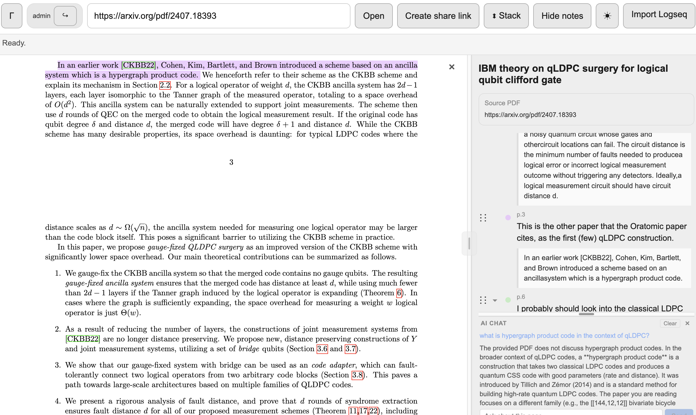
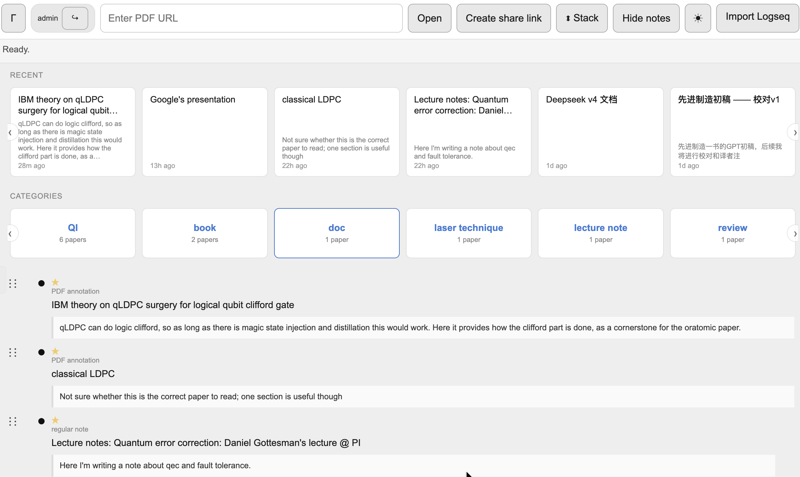
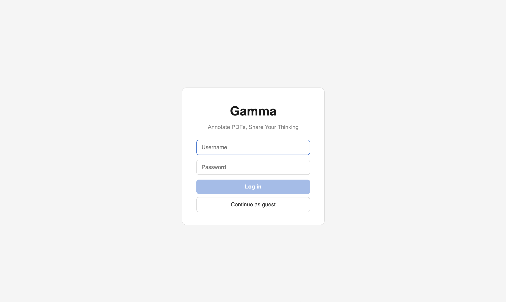
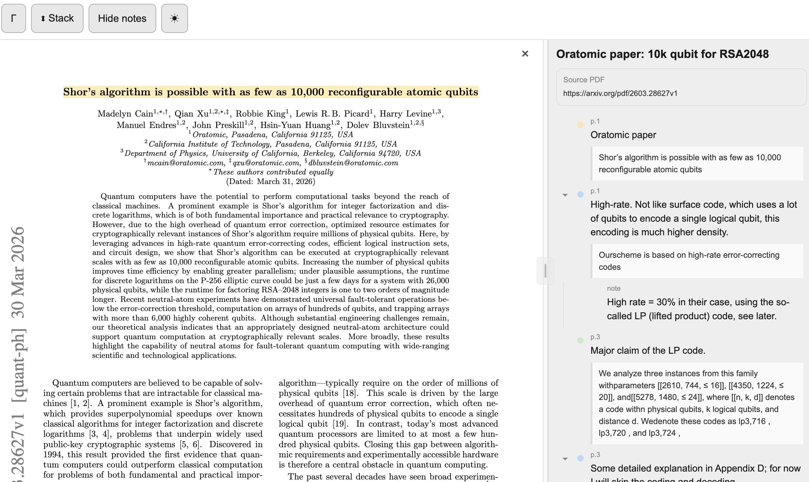

<picture>
  <source media="(prefers-color-scheme: dark)" srcset="./logos/gamma-logo-dark.svg">
  <source media="(prefers-color-scheme: light)" srcset="./logos/gamma-logo-light.svg">
  
</picture>

# Gamma PDF Annotator

A self-hosted, Logseq-inspired PDF annotation server. Highlight PDFs in your browser, organize your notes as nested outliner blocks, and share read-only annotated copies via link.

**Live example:** <https://annotation.amogadgetlab.com>
**Shared view example:** <https://annotation.amogadgetlab.com/?share=vZ3UKgXO0LRGaUVg>

## What it does

- Open any PDF by URL or upload it directly (drag-and-drop).
- Select text to create a highlight with optional comment and color.
- Highlights appear as top-level blocks in a Logseq-style outliner.
- Add free notes, nest them under highlights, reorder blocks by drag (siblings and children).
- Browse all your annotated pages from a home view. Pages themselves are reorderable.
- Open a page with no PDF attached — just notes, like a Logseq page.
- Everything auto-saves. Reloading a page restores highlights, notes, structure, and title.
- Generate a read-only share link for any annotated PDF.
- Multi-user accounts with per-user isolated data. Guest account with daily reset.

## Screenshots

### Annotated PDF with block tree



The core view: PDF with colored highlights on one side, Logseq-style nested block tree on the other, and the AI chat panel anchored at the bottom of the sidebar. Click a highlight dot to jump the PDF to that position; click a PDF highlight to scroll the sidebar to its block. Drag the splitter above the chat to resize it.

### Home page with category carousels



All your pages grouped by category tag. Each row scrolls independently with arrow controls. An "All" section at the top shows recently updated pages.

### Login page



App-level authentication with username and password. Guest accounts get a fresh workspace each day — no registration needed.

### Shared link (public view)



Generate a read-only link for any annotated PDF. Recipients see the PDF, highlights, and block tree — no login required. The editor stays gated behind authentication.

## Inspired by Logseq

Logseq is an excellent outliner-based knowledge-management tool. Gamma takes several ideas from it that work well for PDF annotation specifically:

- **Everything is a block.** Highlights and free notes aren't different entities — both are rows in the same `blocks` table, distinguished only by whether they carry a `highlight_id` property. Both can be nested, reordered, styled identically.
- **Pages are the top-level container.** A PDF corresponds to exactly one page; all its highlights and notes live as blocks inside that page.
- **Outliner editing.** Enter for sibling, Tab for indent, Shift+Tab for outdent, Backspace on empty to delete. One-click to edit, cursor lands near the click point.
- **Drop indicator for tree drags.** Like Logseq, Gamma shows a single horizontal blue line during drag; its horizontal position snaps to valid nesting depths (sibling of current, first child of target, or sibling of any ancestor).
- **Nested guide lines.** The vertical line to the left of nested blocks mimics Logseq's `.block-children` border-left pattern.
- **Fractional indexing for page order.** Custom ordering of pages persists across reorder without renumbering, using the same `a0`, `a1`, `a0V` key scheme Logseq uses for blocks.

Gamma is narrower than Logseq — no graph view, no daily journal, no queries. The feature set is tuned for "I want to annotate PDFs and keep the notes organized as a tree."

## View modes

The app has three coexisting modes, each derived from what's in the URL:

- **Home** (`/`) — when no PDF is loaded, shows a list of all your pages as blocks. Each entry shows the page title and a preview of its first block. Click a page to open it. Pages are drag-reorderable.
- **PDF + notes** (`/?page=<id>`, page has a source URL) — side-by-side (or stacked) PDF viewer and block tree. The default working view. Close-PDF (X button) temporarily hides the viewer, letting the block tree fill the width; clicking a highlight dot re-opens the PDF and jumps to that highlight.
- **Page only** (`/?page=<id>`, page has no source URL) — just the block tree, full-width. Create notes without a PDF attached, or use the home-page-style to collect thoughts.

Shared links (`/?share=<token>`) are a separate public read-only view: PDF + block tree, but editing and navigation are locked.

## Architecture

Three pieces:

1. **Backend** (`backend/app.py`) — a FastAPI app with per-user SQLite databases:
   - `users.db` — accounts, sessions (bcrypt passwords), and share tokens.
   - `users/{username}/pages.db` — a `unified_blocks` table per user with self-referential `parent_id`. Root-level blocks are pages; everything else is nested blocks.
   - `users/{username}/data.db` — annotations (per-user).
   - `users/{username}/uploads/` — uploaded PDFs and images, content-hash deduped.
   - App-level authentication via session cookies. No external auth provider needed.
2. **CLI** (`backend/manage.py`) — user management. `create-user`, `set-password`, `delete-user`, `list-users`, `reset-guest`.
3. **Frontend** (`logseq-v2-frontend/`) — React + Vite.
   - `src/App.jsx` — main component. Routing, PDF loading, block tree render, drag-and-drop, autosave, login page.
   - `src/logseqPdfModel.js` — block tree operations (insert, indent/outdent, flatten, extract, sibling/child insertion, cycle check).
   - `src/app.css` — dark/light themed styling.
4. **Reverse proxy** — Caddy routes the domain to the frontend and `/api/*` to the backend. No special auth configuration needed — the app handles login itself.

## Running locally

### Prerequisites

- Python 3.11+
- Node.js 18+
- Caddy (optional, only if you want domain routing + auth)

### Backend

```bash
cd backend
python3 -m venv venv
source venv/bin/activate
pip install fastapi uvicorn aiosqlite pydantic python-multipart fractional-indexing PyPDF2 bcrypt
python manage.py create-user admin yourpassword
python manage.py setup      # creates guest account
uvicorn app:app --host 127.0.0.1 --port 9001
```

The AI chat feature requires an API key compatible with the Anthropic Messages API (works with Anthropic and DeepSeek):

```bash
export ANTHROPIC_AUTH_TOKEN="your-api-key"
# optionally override the base URL and model:
export ANTHROPIC_BASE_URL="https://api.deepseek.com/anthropic"
export ANTHROPIC_DEFAULT_HAIKU_MODEL="deepseek-v4-flash"
```

The backend auto-creates `data.db` and `pages.db` on first start, runs all pending migrations (adds `doc_id`, `position`, and `source_url` columns to `pages` as needed), and seeds the `blocks` table from any existing `annotations` rows.

### Frontend

```bash
cd logseq-v2-frontend
npm install
npm run dev        # development server on :5173
# or
npm run build && npm run preview    # production build on :4173
```

### Putting it together

In development, proxy `/api/*` from the frontend to `127.0.0.1:9001` via a Vite proxy config or Caddy. See `vite.config.js` for the current setup.

For production-style hosting:

```caddyfile
your-domain.com {
    handle /api/* {
        reverse_proxy 127.0.0.1:9001
    }
    handle {
        reverse_proxy 127.0.0.1:4173
    }
}
```

Authentication is handled by the app itself — no Caddy basic auth needed.

### Remote VM deployment

1. Clone the repo on your VM.
2. Follow the Backend and Frontend setup steps above.
3. Install Caddy and configure it with your domain (see Caddyfile example above).
4. Build the frontend (`npm run build` in `logseq-v2-frontend/`).
5. Run the backend as a service (use systemd or tmux):
   ```bash
   cd backend
   source venv/bin/activate
   uvicorn app:app --host 127.0.0.1 --port 9001
   ```
6. Run the frontend preview server:
   ```bash
   cd logseq-v2-frontend
   npx vite preview --host 127.0.0.1 --port 4173
   ```
7. Point Caddy to your domain and start it.

### Environment variables

| Variable | Required | Default | Description |
|---|---|---|---|
| `ANTHROPIC_AUTH_TOKEN` | For AI chat | — | API key for Anthropic-compatible chat (DeepSeek, Anthropic) |
| `ANTHROPIC_BASE_URL` | No | `https://api.anthropic.com` | Override the API base URL (e.g. `https://api.deepseek.com/anthropic`) |
| `ANTHROPIC_DEFAULT_HAIKU_MODEL` | No | `claude-sonnet-4-20250514` | Model name for the AI chat |

The backend auto-creates `data.db` and `pages.db` on first start.

## Features

- **PDF loading**: open by URL or upload (max 50 MB, content-hashed for dedup).
- **Highlights**: select text, pick color, add comment. Right-click to delete or change color.
- **Logseq EDN import**: import Logseq PDF-highlight exports (EDN + MD + PDF) — preserves highlight positions, notes, and block tree structure.
- **Attach mode**: link orphaned notes to existing PDF highlights — click ⊕ then left-click a highlight. Linked block jumps to the highlight and inherits its color.
- **Cross-note block references**: type `[[` in any block to search and insert a reference to another block. References render as clickable chips that jump to the target.
- **AI chat assistant**: sidebar chatbox sends your question + the PDF's extracted text (up to 8000 chars) to an Anthropic-compatible API (DeepSeek by default). Supports uploaded PDFs and URLs. Configured via `ANTHROPIC_AUTH_TOKEN` env var.
- **Category metadata**: tag-style category input with autocomplete from existing categories. Arrow-key navigation, comma to add tags. Home page shows grouped carousels by category.
- **Light/dark theme toggle**: cycles Dark ☾ / Light ☀ / Follow system ◐ (listens to `prefers-color-scheme`). Persisted in localStorage.
- **Session persistence**: last-opened page, collapsed states, zoom, orientation, PDF toggle, notes toggle, splitter position, and current PDF page survive page reload (localStorage + block properties).
- **Outliner block tree**: highlights and free notes rendered as nested blocks with Logseq-style vertical guide lines. Enter for sibling, Tab for indent, Shift+Tab for outdent, Backspace on empty to delete.
- **Rich text**: markdown + KaTeX math in view mode, raw markdown in edit mode. One-click to edit; cursor lands near the click point.
- **Drag-and-drop blocks**: hover over a block's left edge, grab the ⋮⋮ handle. Drop as sibling or as child. Cycle prevention rejects drops that would nest a block into its own subtree. Horizontal line indicator slides to show intended depth.
- **Page home view**: all pages listed as blocks, orderable via drag, click to open.
- **Pages without PDF**: pages with no source URL open as block-tree-only; useful for free-form notes.
- **Close-PDF**: X button on the viewer hides the PDF temporarily while keeping it loaded. Clicking a highlight dot re-opens the viewer and jumps to that highlight.
- **Layout toggles**: side-by-side (default) or stacked. Hide notes to see only the PDF.
- **Renameable page title**: click the title to rename.
- **Share links**: read-only URL, public, PDF + highlights + notes all preserved. Click PDF highlight → sidebar jumps to its block. Backlinks shown with "private block" for cross-page references.
- **Multi-user accounts**: per-user isolated databases and uploaded files. Session-based auth with bcrypt passwords. Guest account with daily data reset. Admin-managed via CLI — no public registration.
- **Mobile**: dedicated drag handle on the splitter for touch.

## URL routing

- `/` → home view (pages list).
- `/?page=<page_id>` → open a page (with or without PDF).
- `/?block=<block_id>` → open the page containing this block, then scroll to it.
- `/?share=<token>` → public read-only view of a shared page.
- `/?src=<url>` → legacy, redirects to `?page=<id>` after loading.

## Known limitations


- Autosave is debounced at 500 ms. Closing the tab within that window can lose the last keystroke.
- No conflict handling for simultaneous edits across tabs/devices. Last write wins.

## Future work

- Password change and account deletion via the app UI (currently CLI-only).
- Conflict resolution / multi-device sync.
- Collaboration between users (shared pages, cross-user block references).

## Directory layout

```
pdf-share/
├── backend/              # FastAPI + SQLite
│   ├── app.py            # all endpoints
│   ├── data.db           # annotations + shares (gitignored)
│   └── pages.db          # pages + blocks (gitignored)
├── logseq-v2-frontend/   # React + Vite
│   ├── src/
│   │   ├── App.jsx
│   │   ├── logseqPdfModel.js
│   │   ├── app.css
│   │   └── main.jsx
│   ├── public/
│   │   └── pdf.worker.min.mjs
│   ├── package.json
│   └── vite.config.js
├── uploads/              # user-uploaded PDFs, content-hashed (gitignored)
└── archive/              # session backups, tarballed (gitignored)
```

## History

The codebase went through several layered iterations before landing here. An earlier frontend (`rph-frontend`) accumulated feature layers — share links, colored highlights, resizable sidebar, outliner, page-sync logic, custom flash animations, overlapping CSS — to the point where debugging any one feature meant fighting the others. The current code is `logseq-v2-frontend`, started as a clean rewrite keeping only the share-link flow, with later additions built on a consistent block-based data model.

Notable architectural decisions:

- Pages are the top-level container for a PDF's annotations (Logseq model), not the annotations themselves.
- Highlights are blocks with a `highlight_id` property; free notes are blocks without. Both persist identically, both can be reordered, both can have children.
- Block ordering within a page uses a plain integer `position` column, not fractional indexing. Page ordering on the home view uses fractional indexing so reorders only touch the moved page, not every sibling.
- The `annotations` table in `data.db` is kept for backward compatibility but is no longer the source of truth — `blocks` in `pages.db` is. A one-time startup migration seeds the blocks table from existing annotations.
- URL routing moved from `?src=<url>` to `?page=<id>` as the canonical form. `?src=...` still works but redirects to `?page=...` after loading the page record.

## License

MIT
