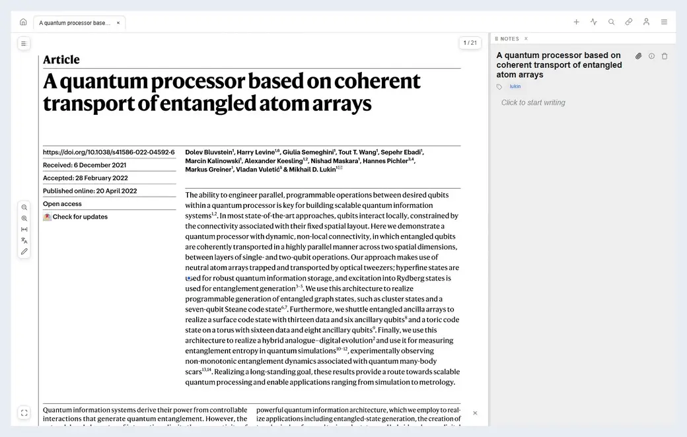
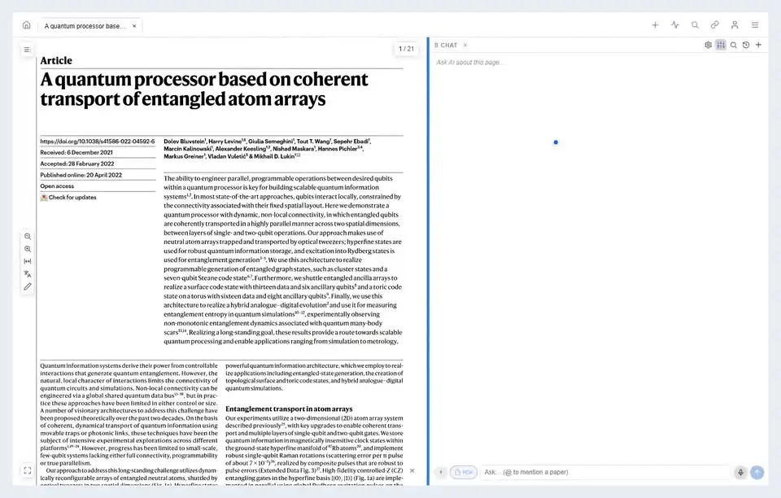
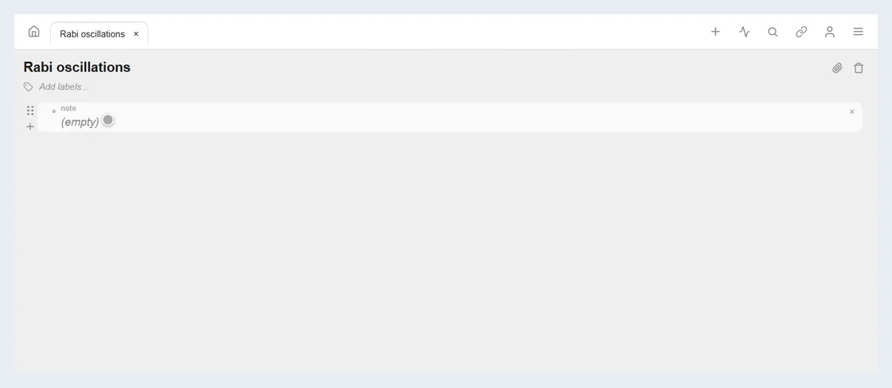
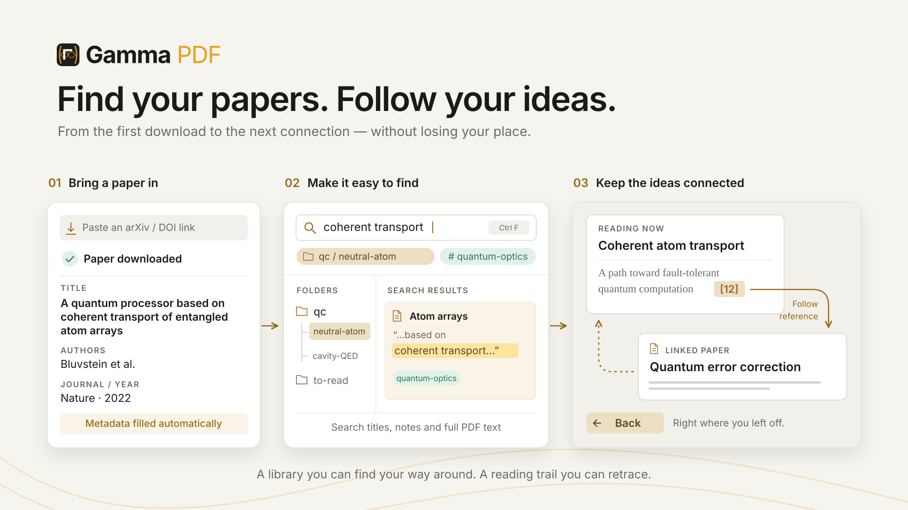
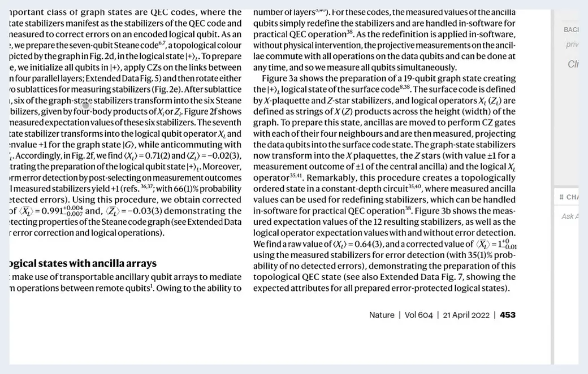
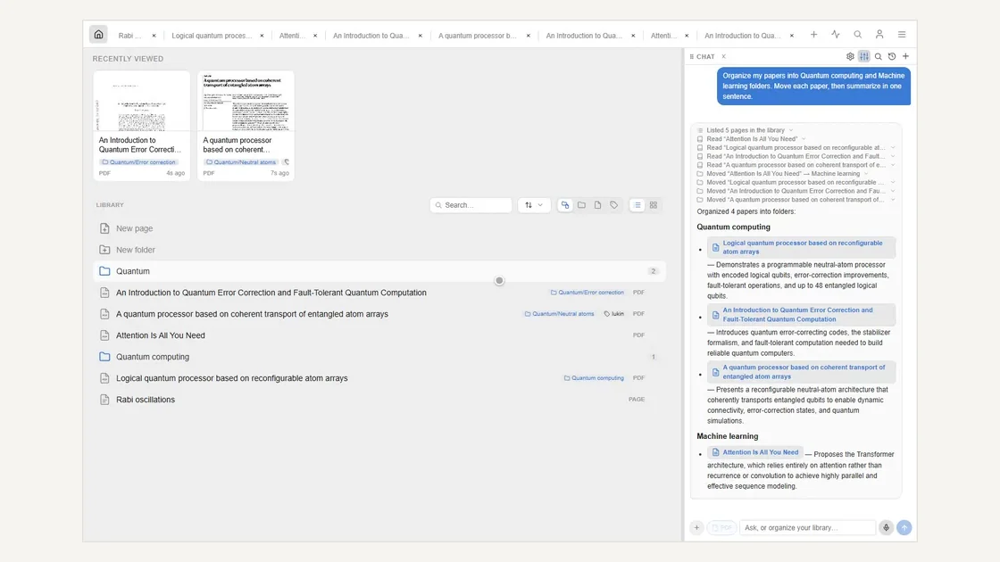
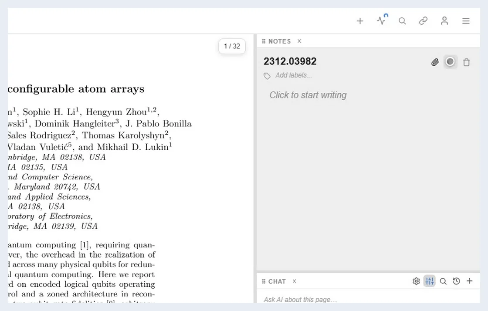
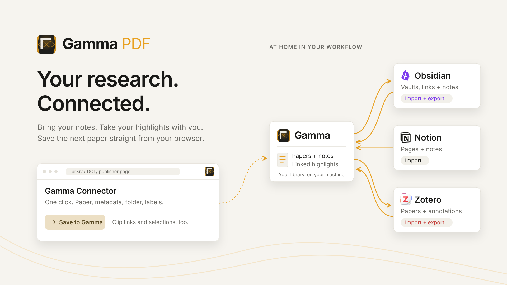

<picture>
  <source media="(prefers-color-scheme: dark)" srcset="./docs/assets/branding/gamma-hero-dark.svg">
  <source media="(prefers-color-scheme: light)" srcset="./docs/assets/branding/gamma-hero-light.svg">
  
</picture>

# Gamma PDF Annotator

**Organize papers and knowledge, in one place.** Self-hosted, multi-user, Logseq-inspired: read and annotate PDFs in your browser, keep the notes as a nested outliner, and link everything together.

[](https://github.com/tim4431/Gamma/releases/latest)
[](https://github.com/tim4431/Gamma/stargazers)
[](https://github.com/tim4431/Gamma/forks)

<a href="https://apps.microsoft.com/detail/9N8WGWR2J2MV">
  
</a>

## 📄 Highlight, annotate & draw



Open a paper by pasting any link (arXiv, DOI, or a publisher page — Gamma finds the PDF, and falls back to a legal open-access copy via Unpaywall when the DOI is paywalled) or drag the file in. Then:

- **Highlight** — select text or drag a box around a figure, pick a color, add a comment. Each highlight becomes a block. Highlights already saved in the file by SumatraPDF, Acrobat, or Preview are imported as blocks too.
- **Draw** — use a stylus or mouse to circle a claim, sketch an arrow, or highlight freely. Lasso strokes to move, resize, rotate, or recolor them; erase whole strokes or just part of one, with undo and redo. Ink becomes a note block linked to its place in the PDF.
- **Dockable panels** — drag any window's grip to the left, right, or bottom; double-click to collapse.

## ✨ Native agentic



- **Chat with your papers** — ask about the open PDF, paste figures, dictate by voice, or attach the whole PDF so the model sees tables and plots. Use Anthropic or OpenAI models, or sign in with your ChatGPT subscription — no API key.
- **Mention a paper** — type `@` to find and attach a library page. Its details and text stay in context for follow-up questions.
- **Put the agent to work** — ask it to search your library, read papers, compare findings, rename pages, or organize them into folders. Expand each tool step to inspect its arguments and results.

## ✍️ Take notes



Highlights and free notes are the same kind of block, so a paper's notes and a plain page are edited the same way:

- **Pictures** — paste an image into a note, then drag its edge to adjust the size.
- **Outliner** — Enter for a new block, Tab / Shift+Tab to nest, drag to reorder, one undo history for the whole page.
- **Live preview, Obsidian-style** — markdown, `$…$` / `$$…$$` math, code fences, callouts, and tables render in place while the block you're on stays raw. Math gets bracket-pair coloring, `\command` autocomplete, and Tab hops between `{}` arguments.
- **Link and embed** — `[[page]]` mentions, `![[block]]` embeds that edit the source in place, and a "/" menu for everything else. Click a highlight block to jump the PDF to it (and back).

## 🔗 Link and organize

<picture>
  <source media="(prefers-color-scheme: dark)" srcset="./docs/assets/branding/gamma-library-dark.svg">
  <source media="(prefers-color-scheme: light)" srcset="./docs/assets/branding/gamma-library-light.svg">
  
</picture>



- **Reference links** — citations in the PDF are clickable: jump to the reference, unwind jumps across documents with a global **← Back**, and fetch a cited arXiv/DOI paper into your library in one click. You can also link a citation to a paper you already have.
- **Labels** — flat, cross-cutting tags for facets like an author or a keyword; a paper can carry several, and each is one click to filter by.
- **Folders** — a topic hierarchy that builds itself from the paths you use: drop a paper into `qc/neutral-atom` and you get a **qc** folder with a **neutral-atom** subfolder — add `qc/superconducting` and the sibling appears, no need to hand-create each level as its own tag. Storage stays flat, so one paper can live in several folders.



- **Search everything** — `Ctrl+F` searches across notes, highlights, and the full text of every PDF at once, with match-case / whole-word / regex toggles. Narrow the scope with chips for **both** labels (exact match, e.g. an author) and folders (prefix match, so `qc` pulls in everything beneath it). Matching is forgiving: "3000" finds "3,000-qubit" across a line break.



- **Metadata & citations** — on open, each paper is resolved (arXiv → DOI → AI) so the title, authors, and venue auto-fill; any field can be hand-edited in the popover. One click copies BibTeX or a slide-ready citation that pastes into PowerPoint with real italics.

## 🌐 Connect your research

<picture>
  <source media="(prefers-color-scheme: dark)" srcset="./docs/assets/branding/gamma-connections-dark.svg">
  <source media="(prefers-color-scheme: light)" srcset="./docs/assets/branding/gamma-connections-light.svg">
  
</picture>

The **Gamma Connector** extension ([extension/](./extension/)) saves the paper you're reading in one click — PDF, metadata, folder, and labels — straight from the arXiv / DOI / publisher tab. Right-click clips a link or a text selection into your notes.

The **[Gamma PDF plugin for Codex](./plugins/gamma/)** lets Codex search and read your papers, notes, highlights, and PDF text with read-only access to a workspace you approve. Open **Settings → Integrations → Codex CLI**, copy the setup command for your operating system, and run it on the computer where you use Codex. It installs the plugin from a published Gamma release and opens Gamma sign-in. Approve a workspace, then start a new Codex chat and ask, “Use Gamma to find my notes about…” Requires the Codex CLI and a running, reachable Gamma server. Other MCP assistants can connect using the server URL in the same panel; see the [connection guide](./docs/dev/mcp.md).

For a remotely hosted Gamma, an administrator can enable assistant sign-in in
**Settings → Server → Public server URL**. Confirm the suggested
HTTPS address once; Gamma saves it and applies it immediately, without environment
variables or a server restart. Then connect from **Settings → Integrations**.

## Share, sync and move your data

<picture>
  <source media="(prefers-color-scheme: dark)" srcset="./docs/assets/branding/gamma-workspaces-dark.svg">
  <source media="(prefers-color-scheme: light)" srcset="./docs/assets/branding/gamma-workspaces-light.svg">
  
</picture>

- **Workspaces** — keep separate personal libraries or collaborate in a shared library created by a server administrator. Owners manage members; editors change pages; viewers read. Switch from the account menu and manage libraries in Settings → Workspaces.
- **Share a page** — send a link to an annotated paper; invite people with view or edit rights, or open it to anyone with the link.
- **Edit together** — changes and cursors appear live. Edits to different blocks can coexist; simultaneous typing in the same block uses the last content write accepted by the server.
- **Tabs follow you** — open tabs and reading positions sync separately for each account and workspace. Chats in a shared workspace are visible to its members.
- **Import** — Logseq PDF exports and Zotero libraries come in as pages with their annotations; Markdown folders, Obsidian vaults (wikilinks, block embeds, tags) and Notion exports come in as notes.
- **Export a page or folder** — as annotated PDF, Markdown, an Obsidian vault (wikilinks, `^id` anchors, highlights as quote callouts linking the PDF page), a Logseq graph, a Zotero library, or a Gamma zip another Gamma can merge.
- **Export and back up** — export a workspace, or all your personal workspaces, from Settings → Workspaces. Restore or merge a workspace export there; keep server-side workspace snapshots in Settings → Backups. Account credentials and private AI keys are not included.

---

## Install

### Downloads

Get the Windows app from the [**Microsoft Store**](https://apps.microsoft.com/detail/9N8WGWR2J2MV), or download standalone installers from [**GitHub Releases**](https://github.com/tim4431/Gamma/releases/latest).

- **Desktop app** (Windows installer, macOS dmg, Debian/Ubuntu deb) — a self-contained Gamma with local libraries on your disk, no Docker, Python, or Node. It also opens any Gamma server you host (the NAS, a VPS) as another workspace and switches between them from the toolbar. Details: [desktop/](./desktop/). Builds are not notarized: Windows SmartScreen → *More info → Run anyway*; macOS says *Apple could not verify Gamma* on first launch → *System Settings → Privacy & Security → Open Anyway* (once); Linux: `sudo apt install ./Gamma-<version>-linux-amd64.deb`. Windows and Linux apps update themselves.
- **iPad** — open your server in Safari, Share → *Add to Home Screen*: Gamma runs full screen from the icon, and the Apple Pencil writes on papers with pressure while fingers scroll. Chrome and Edge offer *Install Gamma* for the same on other tablets and desktops. Details: [docs/dev/ipad.md](./docs/dev/ipad.md).
- **Gamma Connector** browser extension (`gamma-connector-<version>.zip`, in its own `extension-v<version>` release) — unzip, then `chrome://extensions` → *Developer mode* → *Load unpacked*.
- **Server** — the Docker image below, built from `main` on every merge.

### Quickstart

```bash
docker run -d --name gamma -p 9001:9001 -v gamma-data:/data ghcr.io/tim4431/gamma:latest
```

Open <http://localhost:9001> and log in as `admin` — a fresh instance seeds the account itself and prints its password once to the log (`docker logs gamma`). No environment variables needed.

### Docker Compose (recommended)

Copy the template (the real file is gitignored, so local tweaks never land in commits) and start:

```bash
cp docker-compose.yml.example docker-compose.yml
docker compose up -d
```

Open <http://localhost:9001> and log in with the seeded `admin` password from `docker logs gamma` (printed once on first start). Accounts, notes and uploaded PDFs live under the container's `/data` volume and survive upgrades.

For one library, use **Export / Import** in Settings → Workspaces or keep snapshots in Settings → Backups. For the whole instance, administrators use **Server backups** in Settings → Server; restore these with the server stopped using `manage.py backups --restore`. See the [backup guide](./docs/dev/workspaces.md#export-and-backups) for the distinction. If you bind-mount `/data` to a host folder, set `PUID`/`PGID` to your user's ids (`id -u` / `id -g`) so the files belong to you instead of root.

Users are managed in the app: sign in with an admin account → account menu → *Manage users…* (create/delete accounts, reset passwords, grant or revoke the admin privilege — admin is a flag, not a special name). The CLI equivalent still works:

```bash
docker exec gamma python manage.py create-user alice her-password
docker exec gamma python manage.py set-admin alice on
docker exec gamma python manage.py list-users
```

<details>
<summary><b>Run from source (development)</b></summary>

Requires Python 3.11+ and Node 18+.

**Backend**

```bash
cd backend
python -m venv venv && source venv/bin/activate   # Windows: venv\Scripts\activate
pip install -r requirements.txt
python manage.py create-user admin yourpassword
python manage.py set-admin admin on                 # admin privilege → GUI user management
python manage.py setup                              # seeds the guest account
uvicorn app:app --host 127.0.0.1 --port 9001
```

**Frontend**

```bash
cd frontend
npm install
npm run dev        # :5173, proxies /api → :9001
```

Frontend source is grouped by function (`editor/`, `pdf/`, `settings/`, and
others), with startup/session code in `app/` and reused code in `shared/`.
See the [frontend source map](./frontend/src/README.md) for file locations and
naming conventions.

**Tests**

```bash
cd backend
pip install -r requirements-dev.txt
python -m pytest tests -q
```

In-process API tests against a throwaway data dir — auth, the block tree, metadata/BibTeX, PDF-annotation import, full-text search, and export.

Frontend checks, from `frontend/`: `npm test` for module tests, `npm run build`
for the production bundle, and `npm run e2e` for the browser suite against an
isolated backend (requires backend dependencies and Playwright Chromium).

**Production without Docker** — build the frontend and let the backend serve it:

```bash
cd frontend && npm run build
cd ../backend
GAMMA_STATIC_DIR=../frontend/dist uvicorn app:app --host 127.0.0.1 --port 9001
```

Put a TLS-terminating reverse proxy (Caddy, nginx) in front of 9001 for a domain. If you use HTTP/3, consider limiting Caddy to `protocols h1 h2` — a Chrome QUIC bug can make large PDFs crawl.

</details>

<details>
<summary><b>Environment variables</b></summary>

| Variable | Required | Default | Description |
|---|---|---|---|
| `GAMMA_DATA_DIR` | No | `data/` at the repo root (`/data` in Docker) | Where `users.db` and the per-workspace data live |
| `GAMMA_STATIC_DIR` | No | unset (`/app/static` in Docker) | Built frontend to serve as SPA; unset = API only |
| `GAMMA_PORT` | No | `9001` | Listen port (Docker entrypoint only) |
| `GAMMA_ADMIN_USER` / `GAMMA_ADMIN_PASSWORD` | No | `admin` / random, printed to the log once | Overrides the account a **fresh** instance seeds itself at startup (only while no real accounts exist; never touched afterwards). Admins manage users from the GUI (account menu → *Manage users…*) |
| `GAMMA_AI_ANTHROPIC_BASE_URL` | No | `https://api.anthropic.com` | Default Anthropic-protocol endpoint, e.g. `https://api.deepseek.com/anthropic` |
| `GAMMA_AI_OPENAI_BASE_URL` | No | `https://api.openai.com` | Default OpenAI-compatible endpoint |

AI is configured in the app, not the environment: each user adds provider entries under account menu → *AI providers & keys…* (pick the API format — Anthropic Messages or OpenAI Chat Completions — then a key, plus optional label, base URL, and model list), or connects a ChatGPT Plus/Pro subscription with *Sign in with ChatGPT* — OAuth, no key at all. Keys are stored server-side per user and never sent back to the browser. The base-URL variables above only change the per-protocol defaults shown in that dialog.

</details>

<details>
<summary><b>Docker image</b></summary>

Published to GitHub Container Registry on every push to `main` (`latest`) and on version tags (`v1.2.3` → `1.2.3`, `1.2`), for `linux/amd64` and `linux/arm64`:

```
ghcr.io/tim4431/gamma
```

Multi-stage build: a Node stage compiles the frontend, the final Python image runs FastAPI serving both the API and the SPA on port 9001. See [Dockerfile](./Dockerfile) and [.github/workflows/docker.yml](./.github/workflows/docker.yml).

</details>

## License

Gamma is licensed under the [GNU Affero General Public License v3.0 only](LICENSE)
(`AGPL-3.0-only`). Third-party components and assets retain their respective licenses.
